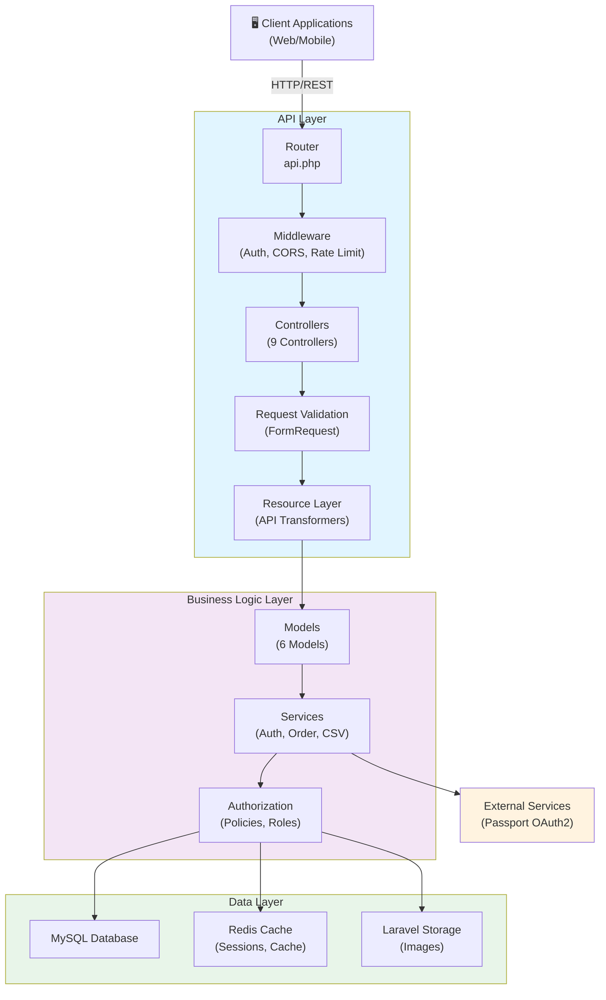
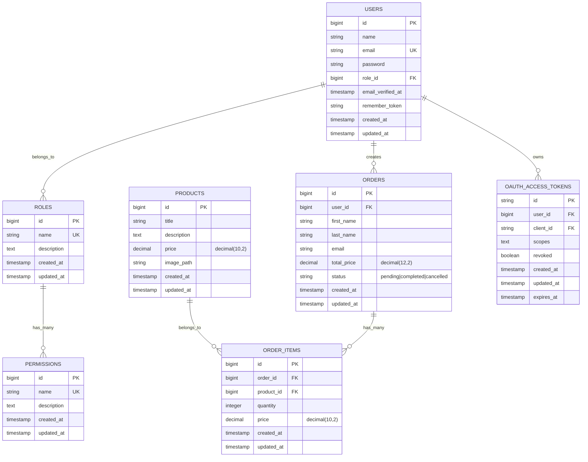
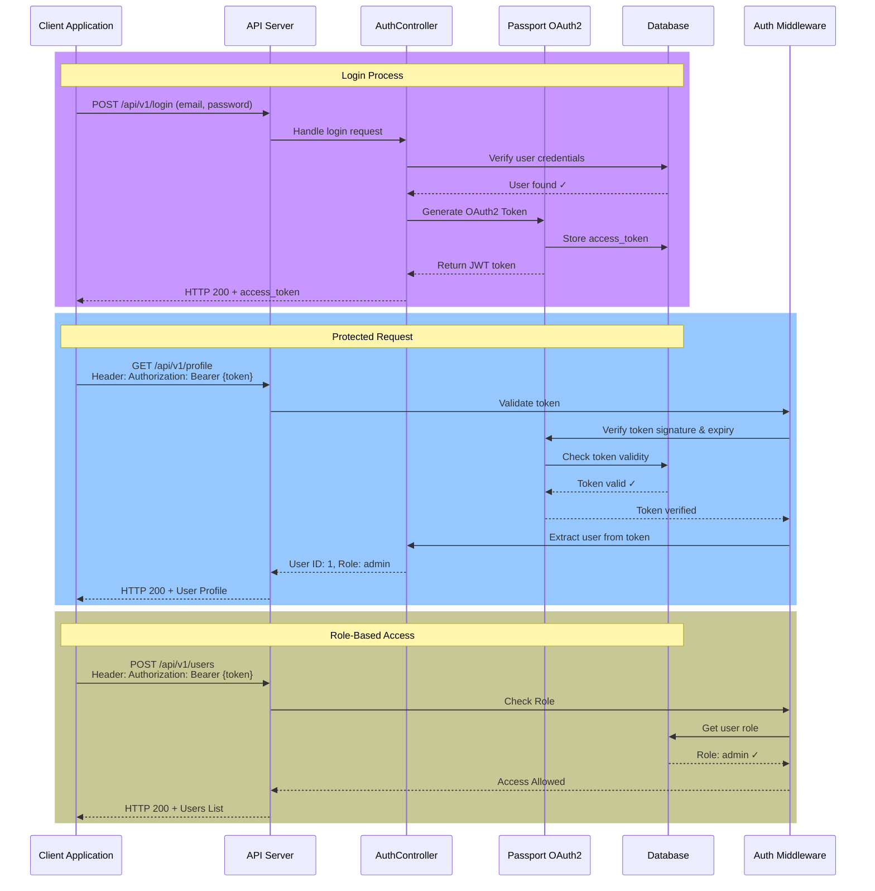
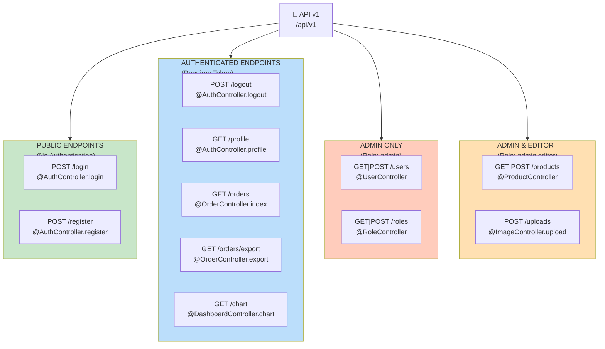
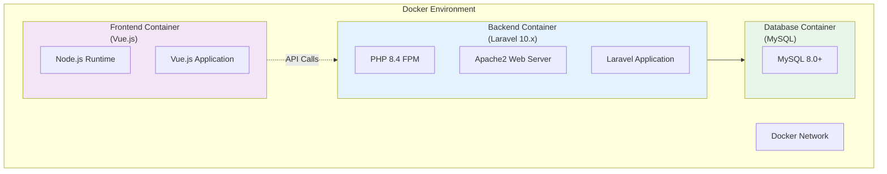
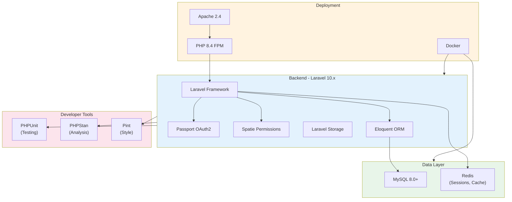

## ⭐ Star this repo if you find it useful!
# Laravel Rest API

A production-ready **Laravel REST API** for admin dashboard backends, featuring role-based access control, Passport authentication, product/order management, and CSV export.

[](https://laravel.com)
[](https://php.net)
[](https://docker.com)
[](LICENSE)
[](https://github.com/Ahmed-Hamdy101/laravel-rest-api/actions/workflows/laravel.yml)
---

## Features

- **JWT authentication** via Laravel Passport
- **Role-based access control** — `admin`, `editor` roles with `CheckRole` middleware
- **User management** — CRUD, profile update, password change
- **Product management** — full CRUD with image upload via Laravel Storage
- **Order management** — list, show, CSV export with streaming cursor
- **Permissions system** — Role ↔ Permission many-to-many relationship
- **API versioning** — all routes under `/api/v1`
- **Input validation** — FormRequest classes for every endpoint
- **API Resources** — controlled serialization, no raw model leaking

---

## System Architecture

### High-Level Overview


---

## Database Schema

### Entity-Relationship Diagram


---

## Authentication & Authorization Flow

### JWT Authentication with Passport


---

## API Endpoint Hierarchy

### Route Structure & Access Control


---

## Project Structure

```
app/
├── Http/
│   ├── Controllers/
│   │   ├── AuthController.php      # login, register, logout
│   │   ├── UserController.php      # user CRUD + profile
│   │   ├── ProductController.php   # product CRUD
│   │   ├── OrderController.php     # order list, show, CSV export
│   │   ├── RoleController.php      # role CRUD
│   │   └── ImageController.php     # image upload → Laravel Storage
│   ├── Middleware/
│   │   └── CheckRole.php           # role:admin,editor gate
│   ├── Requests/                   # FormRequest validation classes
│   └── Resources/                  # API response transformers
├── Models/
│   ├── User.php         # HasApiTokens, role(), hasPermission()
│   ├── Role.php         # permissions() BelongsToMany
│   ├── Permission.php
│   ├── Product.php
│   └── Order.php        # order_items(), getNameAttribute()
routes/
└── api.php              # versioned under /api/v1
```

### Design Decisions

- **Passport over Sanctum** — chosen for full OAuth2 support and access token revocation on logout
- **FormRequest classes** — validation separated from controllers, reusable and testable
- **API Resources** — explicit field allowlisting prevents accidentally leaking sensitive model attributes (e.g. password hash, full role object)
- **`cursor()` for CSV export** — streams orders one at a time instead of loading all into memory, safe for large datasets
- **CheckRole middleware** — role names are checked at the route level, not scattered across controller methods
- **Storage::disk('public')** — images stored via Laravel's filesystem abstraction, not directly in `public/` with `0777` permissions

---

## Deployment Architecture

### Docker Container Architecture


---

## Technology Stack



---

> 📖 **For detailed architecture diagrams, data flows, and system design documentation**, see [docs/ARCHITECTURE.md](docs/ARCHITECTURE.md)

---

## Getting started

### Prerequisites

- PHP 8.2+
- Composer
- MySQL 8.0+
- Docker (optional)

### Installation

```bash
git clone https://github.com/Ahmed-Hamdy101/admin-api-laravel.git
cd admin-api-laravel
composer install
cp .env.example .env
php artisan key:generate
php artisan migrate
php artisan passport:install
php artisan storage:link
```

### Development

```bash
php artisan serve
# API at http://localhost:8000/api/v1
```

### Docker

```bash
docker compose up --build
# API at http://localhost:8000/api/v1
```

---

## API Reference

### Authentication

Protected routes require a Bearer token:
```
Authorization: Bearer <token>
```

### Endpoints

| Method | Endpoint | Auth | Role | Description |
|--------|----------|------|------|-------------|
| POST | `/api/v1/login` | — | — | Login, returns token |
| POST | `/api/v1/register` | — | — | Register new user |
| POST | `/api/v1/logout` | ✅ | — | Revoke current token |
| GET | `/api/v1/profile` | ✅ | — | Get own profile |
| PUT | `/api/v1/profile/info` | ✅ | — | Update name/email |
| PUT | `/api/v1/profile/password` | ✅ | — | Change password |
| GET/POST/PUT/DELETE | `/api/v1/users` | ✅ | admin | User CRUD |
| GET/POST/PUT/DELETE | `/api/v1/roles` | ✅ | admin | Role CRUD |
| GET/POST/PUT/DELETE | `/api/v1/products` | ✅ | admin, editor | Product CRUD |
| POST | `/api/v1/uploads` | ✅ | admin, editor | Upload image |
| GET | `/api/v1/orders` | ✅ | — | List orders (paginated) |
| GET | `/api/v1/orders/{id}` | ✅ | — | Get order detail |
| GET | `/api/v1/orders/export` | ✅ | — | Download orders CSV |

### Example: Login

```bash
curl -X POST http://localhost:8000/api/v1/login \
  -H "Content-Type: application/json" \
  -d '{"email":"admin@example.com","password":"password"}'
```

```json
{
  "token": "eyJ0eXAiOiJKV1QiLCJhbGciOiJSUzI1NiJ9...",
  "user": {
    "id": 1,
    "full_name": "Ahmed Hamdy",
    "email": "admin@example.com",
    "role": "admin"
  }
}
```

---

## Environment variables

| Variable | Description |
|---|---|
| `APP_KEY` | Laravel application key |
| `DB_HOST` | MySQL host |
| `DB_DATABASE` | Database name |
| `DB_USERNAME` | Database user |
| `DB_PASSWORD` | Database password |
| `APP_URL` | Application URL (used for storage links) |

---

## Author

**Ahmed Hamdy** — [GitHub](https://github.com/Ahmed-Hamdy101) · [LinkedIn](https://www.linkedin.com/in/ahmed-hamdy-AH)

## Contributing

Contributions are welcome! Please read [CONTRIBUTING.md](CONTRIBUTING.md) for details.
